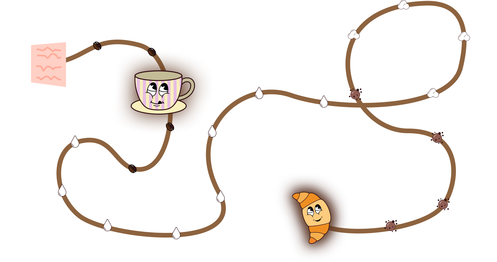
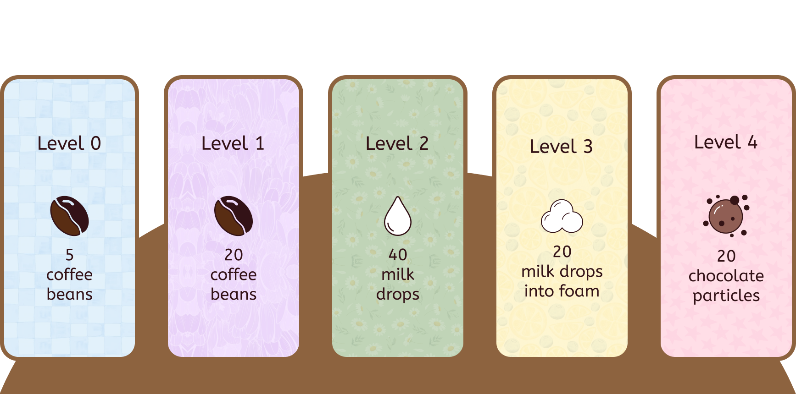
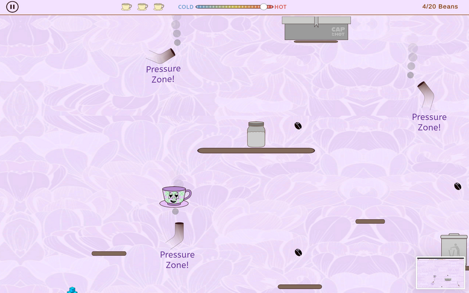
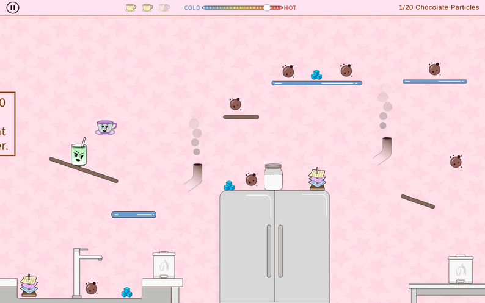
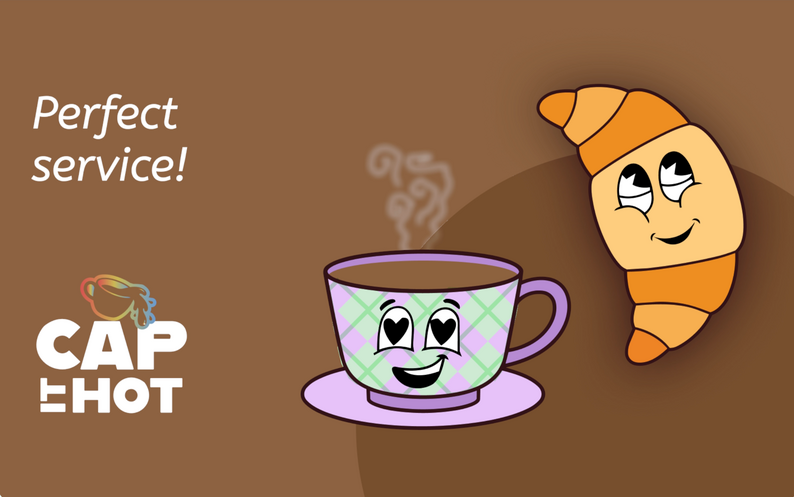

# ☕️ Cap it Hot! – A Café-Themed Game

[](https://unity.com/)
[](https://docs.microsoft.com/en-us/dotnet/csharp/)
[](https://docs.unity3d.com/Manual/SL-Reference.html)
[](https://docs.microsoft.com/en-us/windows/win32/direct3dhlsl/dx-graphics-hlsl)
[](LICENSE)

 <!-- Add your game banner/logo here -->

> **"Race against time, dodge the chaos, and serve the perfect cappuccino!"**

**Cap it Hot!** is a café-themed platformer where the player controls a mug trying to complete a cappuccino order before it gets cold.

Across the levels, the player collects or produces the required cappuccino ingredients, manages temperature, avoids hazards, and reaches the croissant that completes the customer’s order. Each stage introduces a new challenge, from ice blocks and pressure zones to slippery surfaces, Rush Hour order piles, and the Matcha enemy.

---

## 🎮 Game Overview

### Premise
You are a coffee mug in a bustling, chaotic café environment. Your mission? Complete a cappuccino order before it gets cold! Each level represents one critical step in preparing the perfect order. Collect the right ingredients, navigate through hazards, carefully manage your temperature, and race against time to reach the croissant that completes your customer's order.

### Core Gameplay
**Cap it Hot!** combines platforming action with temperature management mechanics in a unique café setting. As you progress through levels, you'll:
- 🧊 **Collect Ingredients**: Gather or produce cappuccino components across different stages
- 🌡️ **Manage Temperature**: Keep your coffee at the perfect serving temperature
- ⚠️ **Avoid Hazards**: Navigate ice blocks, pressure zones, rush hour, and slippery surfaces
- 🍵 **Battle Matcha**: Face off against the mischievous Matcha enemy
- 🥐 **Complete Orders**: Reach the croissant to successfully fulfill the order

---

## 🎯 Game Features

### 🏃 Dynamic Platforming
- Smooth character movement with responsive controls
- Challenging level design with increasing difficulty
- Environmental hazards that test your reflexes
- Time-based gameplay that keeps you on your toes

### 🌡️ Temperature Management System
- Unique mechanic where your coffee temperature affects gameplay
- Collect heat sources to maintain optimal temperature
- Avoid cooling hazards like ice blocks
- Visual temperature indicators to track your status

### ☕️ Progressive Level Design
Each level introduces new challenges and mechanics:
1. **Espresso Extraction** - Learn the basics and collect your first ingredient
2. **Milk Steaming** - Navigate steam pressure zones
3. **Foam Creation** - Master slippery, foam-covered surfaces
4. **Rush Hour Chaos** - Dodge falling order stacks
5. **Matcha Showdown** - Face the final boss enemy
6. **Croissant Collection** - Complete the order!

### 🎨 Café Aesthetics
- Vibrant, stylized art style
- Custom shaders for coffee and steam effects
- Detailed café environment with animated elements
- Charming character design and animations

---

## 🕹️ Controls

 <!-- Add your controls image here -->

| Action | Key |
|--------|-----|
| **Move Left** | ← Left Arrow |
| **Move Right** | → Right Arrow |
| **Jump** | Space Bar |

*Simple, intuitive controls for smooth gameplay!*

---

## 📸 Screenshots & Gameplay

### Premise



### Level Menu



### Levels

<table>
  <tr>
    <td></td>
    <td></td>
  </tr>
</table>


---

## 🚀 Installation & Setup

### Playing the Game

#### Option 1: Download Pre-built Game
1. Go to the [Releases](https://github.com/Harsha-0-0/Computer-Game-Design-Digital-Game/releases) page
2. Download the latest version for your platform
3. Extract the ZIP file
4. Run the executable file
5. Enjoy!

#### Option 2: Play in Browser
*[If available]* Play directly at: [https://yuhao-x.itch.io/cap-it-hot])

### For Developers

1. **Clone the repository**
   ```bash
   git clone https://github.com/Harsha-0-0/Computer-Game-Design-Digital-Game.git
   cd Computer-Game-Design-Digital-Game
   ```

2. **Open in Unity**
   - Open Unity Hub
   - Click "Add" and select the project folder
   - Ensure Unity version 2021.3 or later is installed
   - Open the project

3. **Run the game**
   - Open the main scene: `Assets/Scenes/MainMenu.unity`
   - Press the Play button in Unity Editor
   - Use arrow keys and spacebar to play

4. **Build the game**
   - Go to File → Build Settings
   - Select your target platform
   - Click "Build" and choose output location

---

## 👥 Development Team

### **The Hawkins Guild**

- Harsha Varthini Maniraj  
- Lia Pereira Dullius
- Sona Dheep Raja Balaji
- Yuhao Xu

---


<div align="center">

**Made with ☕️ and ❤️ by The Hawkins Guild**

*Keep it hot, keep it moving, and serve with style!*



</div>
